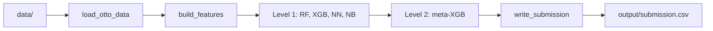

# Otto Product Classification

A **multi-class product classification** project tackling the [Otto Group Product Classification Challenge](https://www.kaggle.com/c/otto-group-product-classification-challenge): predicting which of 9 product categories an item belongs to from 93 anonymized numerical features. Implemented in **R** with multiple modeling approaches, feature engineering, and a **stacked ensemble** optimized for multi-class log loss.

**Quick start** (after placing data in `data/` and installing [dependencies](#requirements)):

```r
setwd("/path/to/OttoProductClassification")  # project root
source("run_pipeline.R")   # stacking ensemble → output/submission.csv
```

---

## Overview

- **Task:** Multi-class classification (9 product classes)
- **Data:** ~62K training samples, ~144K test samples, 93 features (`feat_1`–`feat_93`)
- **Metric:** Multi-class log loss (lower is better)
- **Stack:** R — `data.table`, `xgboost`, `randomForest`, `nnet`, `e1071`, `caret`

---

## Project Structure

```
├── data/                  # Input data (gitignored)
├── output/                # Submission CSVs (gitignored)
├── R/                     # Pipeline modules
│   ├── config.R           # Paths, N_FOLDS, SEED, CLASSES
│   ├── utils.R            # logloss(), normalize_preds()
│   ├── data.R             # load_otto_data()
│   ├── features.R         # build_features() — log, sqrt, scaled, row stats
│   ├── submission.R       # write_submission()
│   ├── models.R           # train_*_cv() for RF, XGBoost, nnet, Naive Bayes, multinomial
│   └── ensemble.R         # run_stacking() — Level 1 + Level 2
├── run_pipeline.R         # Main entry: stacking ensemble → output/submission.csv
├── run_single_models.R    # Single models (RF, MLR, NB, XGB) → output/submission_*.csv
├── install_deps.R         # One-time package installation
├── OttoProductClassification.Rproj   # RStudio project
├── archive/               # Legacy standalone scripts (pre-refactor)
└── LICENSE                # MIT
```

### Pipeline flow



---

## Approach

### Feature engineering

- **Transformations:** log(1 + x), sqrt(x + 3/8), z-score scaling
- **Row-level stats:** row sums, counts of non-zero/zero, mean, min, max (used in meta-features)

### Models

| Entry point | Models / approach |
|-------------|--------------------|
| **run_pipeline.R** | 5-fold CV stacking: Level 1 = RF, XGBoost (raw + log), neural net (`nnet`), Naive Bayes → Level 2 = XGBoost meta-model on L1 predictions + row stats → `output/submission.csv` |
| **run_single_models.R** | Random Forest, multinomial logistic, Naive Bayes, XGBoost (early stopping) → `output/submission_<model>.csv` each |

### Evaluation

- **5-fold cross-validation** for all models
- **Multi-class log loss** for model selection and tuning
- Predictions normalized to valid probability distributions (non-negative, row sums = 1)

---

## Results

After running the stacking pipeline, the script prints Level 1 and Level 2 log loss. You can record your best **CV log loss** here after a full run (e.g. `run_pipeline.R`):

| Model / pipeline      | CV log loss (example) |
|-----------------------|------------------------|
| Stacking (Level 2)    | —                      |
| XGBoost (single)      | —                      |
| Random Forest         | —                      |

Filling this in shows recruiters you ran the pipeline and care about outcomes.

---

## Getting Started

### Requirements

- R (tested with R 4.x)
- Packages: `data.table`, `xgboost`, `randomForest`, `nnet`, `e1071`, `caret`

**Option A** — one-time setup from project root:

```r
source("install_deps.R")
```

**Option B** — install manually:

```r
install.packages(c("data.table", "xgboost", "randomForest", "nnet", "e1071", "caret"))
```

Opening `OttoProductClassification.Rproj` in RStudio sets the project root automatically.

### Data

Place the Otto challenge data in `data/`:

- `train.csv` — columns: `id`, `feat_1` … `feat_93`, `target`
- `test.csv` — columns: `id`, `feat_1` … `feat_93`
- `sampleSubmission.csv` — columns: `id`, `Class_1` … `Class_9`

You can download the dataset from [Kaggle](https://www.kaggle.com/c/otto-group-product-classification-challenge/data).

### Run the stacking pipeline

From the project root in R:

```r
source("run_pipeline.R")
```

Submission file is written to `output/submission.csv` (id + Class_1 … Class_9 probabilities).

### Run single models only

To train and submit RF, multinomial logistic, Naive Bayes, and XGBoost (early stopping) separately:

```r
source("run_single_models.R")
```

Outputs: `output/submission_random_forest.csv`, `submission_multinomial_logistic.csv`, `submission_naive_bayes.csv`, `submission_xgboost_early_stopping.csv`.

---

## Highlights

- **End-to-end ML pipeline:** data I/O, feature engineering, CV, evaluation, and submission generation in R
- **Stacked ensemble:** diverse base models (tree, gradient boosting, neural net, Naive Bayes) combined via a meta-learner
- **Reproducibility:** fixed seeds, consistent train/test splits and normalization
- **Organized pipeline:** shared `R/` modules (config, data, features, models, ensemble, submission) and two entry points (`run_pipeline.R`, `run_single_models.R`)

---

## Skills demonstrated

- **R:** data.table, caret, custom functions, modular sourcing
- **ML:** multi-class classification, stacked ensembles, 5-fold CV, log loss
- **Feature engineering:** log/sqrt transforms, scaling, row-level aggregates
- **Models:** Random Forest, XGBoost, multinomial logistic regression, Naive Bayes, single-hidden-layer neural net (nnet)
- **Reproducibility:** fixed seeds, consistent splits, single entry-point scripts

---

## Future improvements

- [ ] Hyperparameter tuning (e.g. `tidymodels` or grid search over XGBoost/RF params)
- [ ] Additional features (interactions, PCA, or domain-specific aggregates)
- [ ] `renv` or `packrat` for lockfile-based dependency reproducibility
- [ ] Unit tests for `logloss()`, `normalize_preds()`, and data loading

---

## License

This project is for portfolio and educational use. The Otto Group Product Classification Challenge and dataset are by Otto Group / Kaggle; see the competition page for data and usage terms.
